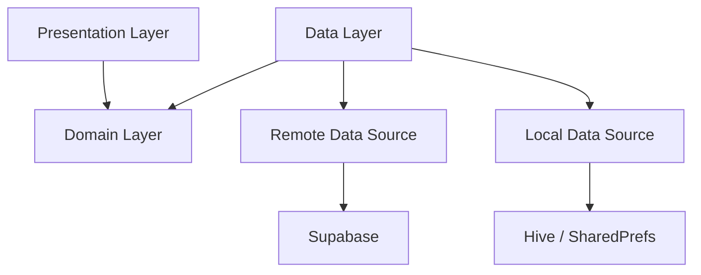

# ⚽ Sport Kick

<div align="center">


**The Ultimate Football Field Booking Platform**

[](https://flutter.dev)
[](https://supabase.com)
[](https://dart.dev)
[](./LICENSE)

</div>

---

## 🚀 Overview

**Sport Kick** is a cutting-edge mobile application designed to revolutionize how football enthusiasts book fields. Replacing outdated phone calls and manual scheduling, Sport Kick offers a seamless, instant booking experience for players and a powerful management suite for field owners.

Built with **Flutter** and **Supabase**, it delivers high performance, real-time updates, and a premium user experience across all devices.

---

## ✨ Key Features

### 👤 For Users (Players)
- **🏟️ Browse & Discover:** Find the best fields in your city with high-quality photos and details.
- **📅 Instant Booking:** View real-time availability and book your slot in seconds.
- **📍 Location Based:** Filter fields by city, sport type, and amenities.
- **📱 Mobile First:** A beautiful, responsive interface designed for on-the-go booking.

### 👑 For Super Admins
- **📊 Dashboard Analytics:** Real-time insights on revenue, bookings, and user growth.
- **👥 User Management:** Full control over user and admin accounts.
- **⚙️ Platform Control:** Manage cities, sport categories, and system-wide settings.
- **📈 Advanced Reporting:** Export detailed reports (CSV/PDF) for data-driven decisions.

### 🏢 For Field Owners (Admins)
- **📅 Schedule Management:** Easy-to-use calendar for managing slots.
- **💰 Revenue Tracking:** Monitor earnings and booking trends.
- **🔔 Real-time Notifications:** Get alerted instantly for new bookings.

---

## 🛠️ Technology Stack

We use a modern, scalable tech stack to ensure reliability and performance.

| Category | Technology | Description |
|----------|------------|-------------|
| **Framework** |  | Cross-platform UI toolkit |
| **Language** |  | Type-safe, compiled language |
| **Backend** |  | PostgreSQL, Auth, Realtime, Storage |
| **State Mgmt** |  | Predictable state management |
| **Architecture** |  | Scalable, testable code structure |

---

## 🏗️ Architecture

Sport Kick follows **Clean Architecture** principles to ensure separation of concerns and maintainability.



- **Presentation:** Widgets, Pages, Cubits (State Management).
- **Domain:** Entities, UseCases, Repository Interfaces (Pure Dart).
- **Data:** Models, Repository Implementations, Data Sources (APIs, DB).

---

## 📱 Screenshots

<div align="center">
  
  
  
  
</div>

---

## 🚀 Getting Started

### Prerequisites
- Flutter SDK (3.10+)
- Dart SDK (3.0+)
- Supabase Project

### Installation

1. **Clone the repository**
   ```bash
   git clone https://github.com/mohammed-2-5/sport_kick.git
   cd sport_kick
   ```

2. **Install dependencies**
   ```bash
   flutter pub get
   ```

3. **Configure Environment**
   Create a `.env` file in the root directory:
   ```env
   SUPABASE_URL=your_supabase_url
   SUPABASE_ANON_KEY=your_supabase_anon_key
   SUPABASE_SERVICE_ROLE_KEY=your_service_role_key
   ```

4. **Run the app**
   ```bash
   flutter run
   ```

---

## 🤝 Contributing

Contributions are welcome! Please read our [Code Quality Standards](CODE_QUALITY_STANDARDS.md) before submitting a Pull Request.

1. Fork the Project
2. Create your Feature Branch (`git checkout -b feature/AmazingFeature`)
3. Commit your Changes (`git commit -m 'feat: Add some AmazingFeature'`)
4. Push to the Branch (`git push origin feature/AmazingFeature`)
5. Open a Pull Request

---

## 📄 License

Distributed under the MIT License. See `LICENSE` for more information.

---

<div align="center">

**Built with ❤️ by the Sport Kick Team**

</div>
